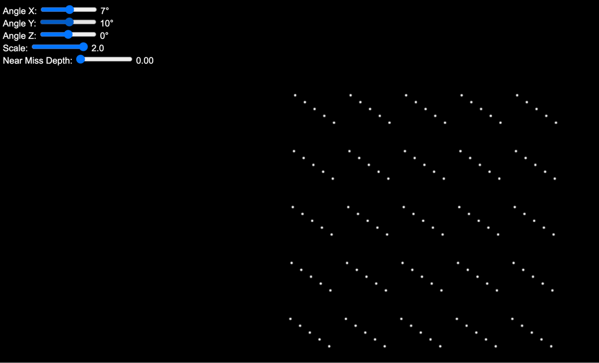
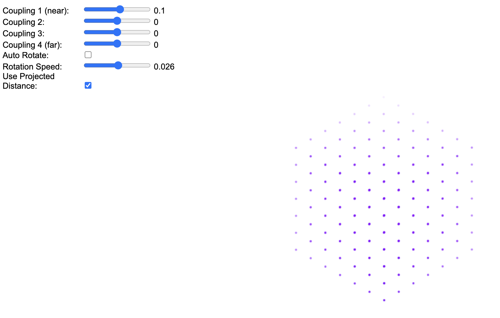

# Cessation Simulations Readme

Welcome to the **Cessation Simulations** repository by the Qualia Research Institute. This README provides detailed information about our simulations, their parameters, and the underlying concepts. For visual aids, please refer to the images located in the `images/` directory.

---

## Table of Contents

- [Introduction](#introduction)
- [Simulations](#simulations)
  - [Gestalt Detector: Simplification via Structural Alignment](#gestalt-detector-simplification-via-structural-alignment)
  - [Standing Wave Pattern Across Multiple Fields: Simplification via Standing Wave Patterns](#standing-wave-pattern-across-multiple-fields-simplification-via-standing-wave-patterns)
  - [Fractal Recursive Coherence: Simplification via Recursion Collapse](#fractal-recursive-coherence-simplification-via-recursion-collapse)
- [Coupling Kernels](#coupling-kernels)
- [Dimensionality Interactions: Metric Sharing](#dimensionality-interactions-metric-sharing)
- [Interacting Nested Dimensional Reduction-Amplification Spaces (INDRAS)](#interacting-nested-dimensional-reduction-amplification-spaces-indras)
- [Acknowledgements](#acknowledgements)
- [References](#references)

---

## Introduction

Cessations are transient states where consciousness appears to fully suspend—or "blink out"—before awareness reemerges. At the Qualia Research Institute, we explore cessations through analysis, investigation, and computational modeling, integrating insights from meditation practices and the use of 5-MeO-DMT, a psychedelic known to induce cessation-like states.

Studying cessations offers valuable insights into valence, the subjective experience of pleasure and pain. These brief interruptions allow us to examine the structure of conscious experience, particularly how consciousness simplifies before a cessation and becomes more complex upon re-emergence. By analyzing these transitions and their associated affective states, we aim to identify the core properties of consciousness that determine valence.

To advance our understanding, we have developed simulations that model how consciousness approaches, enters, and exits cessation states. These models include simulations of wave patterns in phenomenal space, structural alignment across sensory modalities, and fractal recursive coherence. They are designed to support scientific research and assist meditators and psychonauts in navigating and reporting altered states.

---

## Simulations

### Gestalt Detector: Simplification via Structural Alignment

**Description:**
The Gestalt Detector simulation explores how structural alignment can simplify complex informational structures in consciousness. By applying transformations to a complex image modeled as points in a 3D lattice projected onto a 2D screen, the simulation demonstrates how projection angles can align to form unified gestalts, mirroring the process of experiencing a cessation.

**Note:** This simulation does not include adjustable parameters.

**Visuals:**

<video src="images/image13.webm" autoplay loop controls muted class="img-fluid">
Your browser does not support the video tag.
</video>

Changing symmetry/structure as angles/near miss parameters shift

**Try it yourself:** [Gestalt Detector Simulation](https://qri.org/demo/gestalt_detector.html)

---

### Standing Wave Pattern Across Multiple Fields: Simplification via Standing Wave Patterns

**Description:**
This simulation models how different frequencies across parts of a three-dimensional experiential space enable multiple, separable sets of information to coexist within a "topological pocket." As these waves synchronize and move into phase, distinctions between different aspects of mental experience dissolve, culminating in a cessation characterized by a standing wave pattern.

**Parameters:**
This simulation utilizes parameters related to **Coupled Kernels**, which influence the interaction between oscillators.

**Visuals:**

  

    

      <video src="images/image12.webm" autoplay loop controls muted class="img-fluid">
        Your browser does not support the video tag.
      </video>
    

    
5-MeO-DMT Coupling Kernels Pattern

  

  

    

      <video src="images/image10.webm" autoplay loop controls muted class="img-fluid">
        Your browser does not support the video tag.
      </video>
    

    
N,N-DMT Coupling Kernels Pattern

  

**Coupling Constants:**

| Neighbor Type                             | Coupling Constant | 5-MeO-DMT      | N,N-DMT        |
|-------------------------------------------|-------------------|----------------|----------------|
| Immediate Neighbors (Distance = 1)        | K1     | 20             | -10            |
| Neighbors at Distance = 2                 | K2     | 20             | 10             |
| Neighbors at Distance = 3                 | K3     | 10             | -20 to +20     |
| Neighbors at Distance = 4                 | K4     | 0              | 5              |
| Small-World Neighbors (Random Connections)| KSW    | -20 to 20      | 0              |

**Implementation Details:**

- **Model:** Grid of Kuramoto oscillators with specific natural frequencies and phases.
- **Connectivity:** Neighbors up to a Manhattan distance of 4 and two randomly chosen small-world connections, introducing a "small-world" aspect to the network.
- **User Interface:** Five interactive sliders:
  - Four sliders modulate local coupling constants at different Manhattan distances (1 to 4).
  - One "Small World" slider modulates the coupling constant for the random long-range connections.

**Mathematical Model:**

**Phase Update Equation**

For each oscillator \( i \), the phase \( \theta_i \) is updated at each time step \( \Delta t \) according to:

\[
\theta_i(t + \Delta t) = \theta_i(t) + [\omega_i + C_i] \Delta t
\]

Where:

- \( \theta_i(t) \): Current phase of oscillator \( i \).
- \( \omega_i \): Natural frequency of oscillator \( i \).
- \( C_i \): Cumulative influence on oscillator \( i \) from all of its neighbors.

**Coupling Term**

The cumulative influence on oscillator \( i \) from all its neighbors is given by:

\[
C_i = \frac{1}{N_i} \left( \sum_{s=1}^{4} \sum_{j \in D_s} K_s \sin(\theta_j - \theta_i) + \sum_{k \in \text{SW}_i} K_{\text{SW}} \sin(\theta_k - \theta_i) \right)
\]

Where:

- \( D_s \): Set of neighbors at distance \( s \).
- \( K_s \): Coupling constant for neighbors at distance \( s \).
- \( \text{SW}_i \): Set of small-world neighbors for oscillator \( i \).
- \( N_i \): Total number of neighbors (including small-world connections).

**Visualization:**
Each oscillator's phase \( \theta_i \) is mapped to a color using the CIELAB color space, providing a visual representation of phase patterns across the grid.

**Try it yourself:** [Standing Wave Pattern Simulation](https://qri.org/demo/standing_waves.html)

**Additional Visuals and Captions:**

  

    

      
    

    
This configuration demonstrates a 2D standing wave pattern. The projection is set exactly from the corner to produce a hexagonal appearance.

  

  
  

    

      <video class="img-fluid" style="max-height: 100%;" controls autoplay loop muted playsinline>
        <source src="images/image9.webm" type="video/webm">
        Your browser does not support the video tag.
      </video>
    

    
This configuration is similar to the simplest configuration, but with the "Distance" parameter turned off, resulting in a 3D representation. Coupling 1 varies from -0.3 to 0.5 over 20 seconds, showing the convergence process.

  

<table class="table">
<thead>
<tr>
<th>Parameter</th>
<th>Simplest Configuration (2D)</th>
<th>3D Configuration</th>
</tr>
</thead>
<tbody>
<tr>
<td>Coupling 1</td>
<td>-0.1</td>
<td>-0.3 to 0.5 (20s)</td>
</tr>
<tr>
<td>Coupling 2</td>
<td>0</td>
<td>0</td>
</tr>
<tr>
<td>Coupling 3</td>
<td>0</td>
<td>0</td>
</tr>
<tr>
<td>Coupling 4</td>
<td>0</td>
<td>0</td>
</tr>
<tr>
<td>Auto rotate</td>
<td>No</td>
<td>No</td>
</tr>
<tr>
<td>Rotation Speed</td>
<td>N/A</td>
<td>N/A</td>
</tr>
<tr>
<td>Distance</td>
<td>Yes</td>
<td>No</td>
</tr>
<tr>
<td>Projection</td>
<td>Corner (hexagonal)</td>
<td>Corner (hexagonal)</td>
</tr>
</tbody>
</table>

  

    

      <video class="img-fluid" controls autoplay loop muted playsinline>
        <source src="images/image3.webm" type="video/webm">
        Your browser does not support the video tag.
      </video>
    

    
This configuration showcases the transition between 2D and 3D representations with parameters exhibiting similar behavior in both dimensions. The aim is to find 2D projections where resonant modes of the simpler (projected) pattern take hold.

  

  

    

      <video class="img-fluid" controls autoplay loop muted playsinline>
        <source src="images/image6.webm" type="video/webm">
        Your browser does not support the video tag.
      </video>
    

    
In this configuration, we show how using the distance in the projection we can get waves traveling in lines.

  

<table class="table">
<thead>
<tr>
<th>Parameter</th>
<th>Transition 2D to 3D</th>
</tr>
</thead>
<tbody>
<tr>
<td>Coupling 1</td>
<td>0.1</td>
</tr>
<tr>
<td>Coupling 2</td>
<td>0</td>
</tr>
<tr>
<td>Coupling 3</td>
<td>0</td>
</tr>
<tr>
<td>Coupling 4</td>
<td>0</td>
</tr>
<tr>
<td>Auto rotate</td>
<td>No</td>
</tr>
<tr>
<td>Rotation Speed</td>
<td>N/A</td>
</tr>
<tr>
<td>Distance</td>
<td>Yes</td>
</tr>
<tr>
<td>Projection</td>
<td>Square lattice</td>
</tr>
</tbody>
</table>

---

### Fractal Recursive Coherence: Simplification via Recursion Collapse

**Description:**
Building on the concept of the world-sheet, the Fractal Recursive Coherence simulation illustrates how recursive mappings between the visual and somatic fields lead to simplification. Under the influence of 5-MeO-DMT, recursive interactions result in convergence, reducing overall complexity and stabilizing patterns into a unified state.

**Parameters:**

| Parameter              | Value                                   |
|------------------------|-----------------------------------------|
| Lift Dimension         | Ranging through the entire line         |
| Global Rotation        | All the way to the left                 |
| Spatial Frequency X    | All the way to the left                 |
| Spatial Frequency Y    | Almost all the way to the left          |
| Temporal Frequency     | 75%                                     |
| Grating Transparency   | 25%                                     |
| Toggle Cycle Mode      | Off                                     |
| Projection 1           | Rotation - right in the middle          |
| Projection 2           | Scale - right in the middle             |
| Projection 3           | Shear - right in the middle             |
| Projection 4           | Shear                                   |
| Recursion Level        | 4                                       |

**Visuals:**

<video src="images/image7.webm" autoplay loop controls muted class="img-fluid">
Your browser does not support the video tag.
</video>

Fractal Recursive Coherence Simulation

<video src="images/image11.webm" autoplay loop controls muted class="img-fluid">
Your browser does not support the video tag.
</video>

Exploring the Lift Dimension Parameter

**Try it yourself:** [Fractal Recursive Coherence Simulation](https://qri.org/demo/fractal_recursive_coherence.html)

---

## Coupling Kernels

During 5-MeO-DMT experiences, a unique synchronization phenomenon was observed, differing from other psychedelics like mushrooms. To model this, we developed coupled oscillators with modulated coupling constants based on distance, enabling the visualization of DMT and 5-MeO-DMT effects.

**Simulation Overview:**

- **Model:** Grid of Kuramoto oscillators with specific natural frequencies and phases.
- **Connectivity:** Neighbors up to a Manhattan distance of 4 and two randomly chosen small-world connections, introducing a "small-world" aspect to the network.
- **User Interface:** Five interactive sliders:
  - Four sliders modulate local coupling constants at different Manhattan distances (1 to 4).
  - One "Small World" slider modulates the coupling constant for the random long-range connections.
- **Mathematical Model:**

  **Phase Update Equation**

  For each oscillator \( i \), the phase \( \theta_i \) is updated at each time step \( \Delta t \) according to:

  \[
  \theta_i(t + \Delta t) = \theta_i(t) + [\omega_i + C_i] \Delta t
  \]

  **Coupling Term**

  The cumulative influence on oscillator \( i \) from all its neighbors is given by:

  \[
  C_i = \frac{1}{N_i} \left( \sum_{s=1}^{4} \sum_{j \in D_s} K_s \sin(\theta_j - \theta_i) + \sum_{k \in \text{SW}_i} K_{\text{SW}} \sin(\theta_k - \theta_i) \right)
  \]

  Where:

  - \( D_s \): Set of neighbors at distance \( s \).
  - \( K_s \): Coupling constant for neighbors at distance \( s \).
  - \( \text{SW}_i \): Set of small-world neighbors for oscillator \( i \).
  - \( N_i \): Total number of neighbors (including small-world connections).

**Visualization:**
Each oscillator's phase \( \theta_i \) is mapped to a color using the CIELAB color space, providing a visual representation of phase patterns across the grid.

**Visuals:**

---

## Dimensionality Interactions: Metric Sharing

This section explores how interactions between different dimensional spaces (e.g., 3D somatic and 2.5D visual fields) can lead to cessation conditions through synchronization and alignment of wave patterns.

**Key Concepts:**

- **Wave Synchronization:** Seamless interfacing between different sensory fields leads to low-energy configurations.
- **Projection Mapping:** Achieving perfect alignment between projections of different dimensions results in unified wave patterns.
- **Cessation Conditions:** Specific combinations of projections and coupling kernels facilitate the collapse of distinctions between spaces.

**Visuals:**

<iframe width="560" height="315" src="https://www.youtube.com/embed/BRVH-LMCBkA" frameborder="0" allow="accelerometer; autoplay; clipboard-write; encrypted-media; gyroscope; picture-in-picture" allowfullscreen></iframe>

QRI's 4D Wave Simulator

---

## Interacting Nested Dimensional Reduction-Amplification Spaces (INDRAS)

**Description:**
INDRAS models Indra’s Net experiences by recursively mapping spaces of different dimensions onto each other. This framework captures the fractal quality of cessations, where each part of an experience reflects and shapes every other part, leading to highly interconnected and interdependent phenomena.

**Visuals:**

Indra's Net metaphor depicting interconnectedness.

---

## Acknowledgements

We extend our deepest gratitude to Bijan Fakhri and Chris Percy for their invaluable collaboration and insights during our work on cessation simulations. A special thank you to Michael Edward Johnson for years of collaboration at the Qualia Research Institute.

Thank you to Cube Flipper and the High Energy Awareness Research Team. Insights presented in this repository are just the beginning of our collective work.

We are grateful to Hunter, Marcin, and Maggie for their unwavering support throughout this journey. Your belief in this work has been a constant source of strength.

Finally, sincere appreciation to the QRI donors and supporters. Without your generosity and encouragement, none of this would have been possible.

---

## References

- Andres, R. (2016). *Algorithmic Reduction of Psychedelic States*.
- Andres, R. (2016). *The Hyperbolic Geometry of DMT Experiences*.
- Johnson, M.E. (2019). *Neural Annealing: Toward a Neural Theory of Everything*. [Link](https://opentheory.net/neural-annealing-toward-a-neural-theory-of-everything/)
- Johnson, M.E. (2023). *Symmetry Theory of Valence*. [Link](https://qri.org/research/symmetry-theory-of-valence)
- Gómez-Emilsson, A. (2020). *Modeling Coupled Oscillators in Psychedelic States*. [Link](https://qri.org/blog/5meo-vs-dmt)
- Gómez-Emilsson, A. (2021). *Healing Trauma with Neural Annealing*. [Link](https://qualiacomputing.com/2021/05/08/healing-trauma-with-neural-annealing/)
- Lehar, S. (2008). *The Constructive Aspect of Visual Perception*.
- CubeFlipper. (2023). *Wavefronts & Reification*.
- Others as cited in the background sections.

For a full list of resources, visit our [GitHub repository](https://github.com/QualiaResearchInstitute/cessation-simulations).

---

This README serves as an overview of the simulations and their parameters associated with our research on cessations. For more detailed information, please refer to the individual simulation links and our comprehensive [article](https://www.philosophie-e.fb05.uni-mainz.de/files/2024/03/The-2024-Computational-Phenomenology-of-Pure-Awareness-Prize.pdf) submitted to the [Stif Bewwusst Seins Kultur Computational Phenomenology of Pure Awareness Prize Contest](https://www.philosophie-e.fb05.uni-mainz.de/files/2024/03/The-2024-Computational-Phenomenology-of-Pure-Awareness-Prize.pdf).

---
